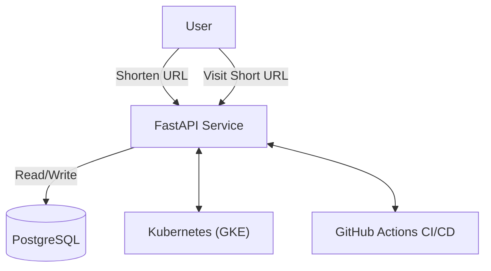

# 🚀 KubeLink - URL Shortener Microservice (GKE + Docker + GitHub CI/CD)

KubeLink is a production-ready, cloud-native URL shortener microservice designed for scalability and reliability. Built with FastAPI, PostgreSQL, Docker, and Kubernetes, it features a fully automated CI/CD pipeline for seamless deployment to Google Kubernetes Engine (GKE) via GitHub Actions.

---

## Table of Contents
- [Features](#features)
- [Architecture](#architecture)
- [Tech Stack](#tech-stack)
- [Getting Started](#getting-started)
  - [Local Development](#local-development)
  - [Production Deployment (GKE)](#production-deployment-gke)
- [API Reference](#api-reference)
- [Kubernetes Manifests](#kubernetes-manifests)
- [CI/CD Pipeline](#cicd-pipeline)
- [Security & Configuration](#security--configuration)
- [License](#license)

---

## Features
- **REST API** for URL shortening and redirection
- **PostgreSQL** persistent storage
- **Dockerized** for portability and reproducibility
- **Kubernetes-native** deployment (GKE-ready)
- **GitHub Actions** for automated CI/CD
- **Secrets & ConfigMap** management
- **Extensible** for frontend integration

---

## Architecture



---

## Tech Stack
- **Backend:** FastAPI (Python)
- **Database:** PostgreSQL
- **Containerization:** Docker
- **Orchestration:** Kubernetes (GKE)
- **CI/CD:** GitHub Actions

---

## Getting Started

### Local Development

1. **Clone the repository:**
   ```bash
   git clone <repo-url>
   cd KubeLink---URL-Shortener-Service
   ```
2. **Start services with Docker Compose:**
   ```bash
   docker-compose up --build
   ```
   - FastAPI: [http://localhost:8000](http://localhost:8000)
   - PostgreSQL: `localhost:5432` (user: `fastapi`, password: `fastapi`, db: `url_shortener`)

3. **API Docs:** [http://localhost:8000/docs](http://localhost:8000/docs)

#### Requirements (for manual run)
- Python 3.12+
- `pip install -r api/requirements.txt`
- PostgreSQL running and accessible

---

### Production Deployment (GKE)

1. **Configure Google Cloud & GKE:**
   - Create a GKE cluster and Container Registry
   - Set up service account and store credentials in GitHub Secrets:
     - `GCP_SA_KEY`, `GCP_PROJECT_ID`, `GKE_CLUSTER_NAME`, `GKE_CLUSTER_REGION`

2. **Push to `main` branch:**
   - Triggers GitHub Actions workflow for build & deploy

3. **Kubernetes Manifests:**
   - Located in `k8s/` directory
   - Includes deployments, services, secrets, and namespace

---

## API Reference

### 1. Shorten URL
- **Endpoint:** `POST /shorten`
- **Request Body:**
  ```json
  { "url": "https://example.com" }
  ```
- **Response:**
  ```json
  { "short_code": "abc123" }
  ```

### 2. Redirect to Original URL
- **Endpoint:** `GET /{short_code}`
- **Response:**
  - **302 Redirect** to the original URL
  - **404** if not found

---

## Kubernetes Manifests
- `k8s/namespace.yaml` – Namespace definition
- `k8s/secret.yaml` – Database credentials (as Kubernetes Secret)
- `k8s/postgres-deployment.yaml` – PostgreSQL Deployment
- `k8s/postgres-service.yaml` – PostgreSQL Service (ClusterIP)
- `k8s/api-deployment.yaml` – FastAPI Deployment
- `k8s/api-service.yaml` – FastAPI Service (LoadBalancer)

**Apply all manifests:**
```bash
kubectl apply -f k8s/
```

---

## CI/CD Pipeline
- **Workflow:** `.github/workflows/deploy.yml`
- **Triggers:** On push to `main`
- **Steps:**
  1. Checkout code
  2. Authenticate to Google Cloud
  3. Build & push Docker image to GCR
  4. Deploy to GKE using `kubectl apply -f k8s/`

---

## Security & Configuration
- **Secrets:** Database credentials managed via Kubernetes Secrets (`k8s/secret.yaml`)
- **Environment Variables:**
  - `DATABASE_URL` for API
  - `POSTGRES_USER`, `POSTGRES_PASSWORD`, `POSTGRES_DB` for DB
- **Production:** Use strong, unique secrets and consider using Google Secret Manager

---

## License

This project is licensed under the MIT License. See [LICENSE](LICENSE) for details.

---

## Contributing

Contributions, issues, and feature requests are welcome! Feel free to open an issue or submit a pull request.

